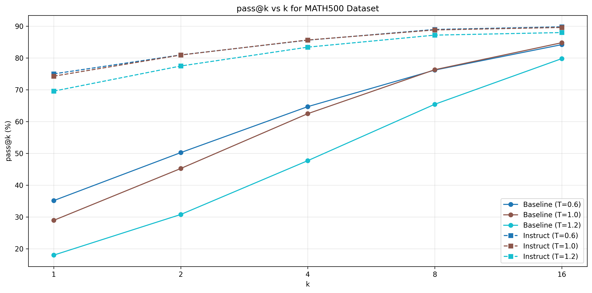
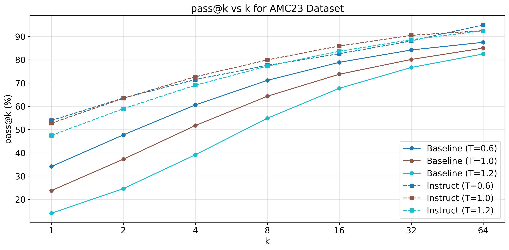
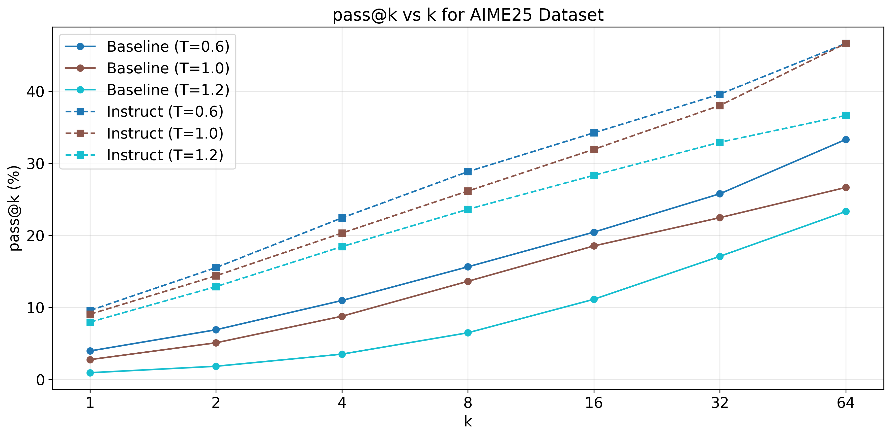
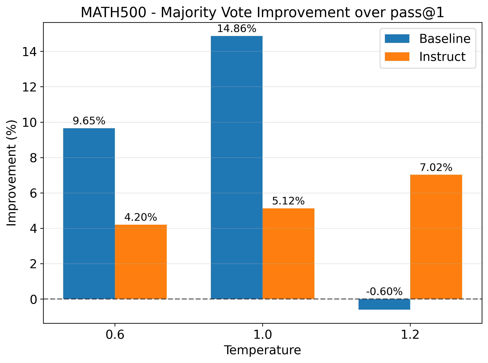
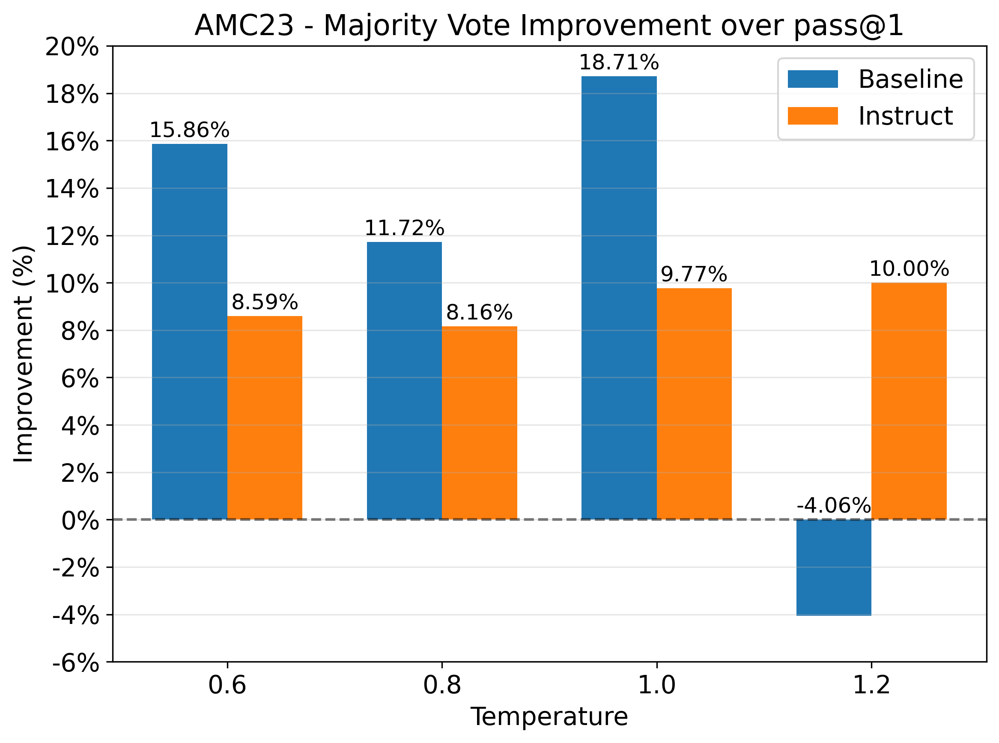
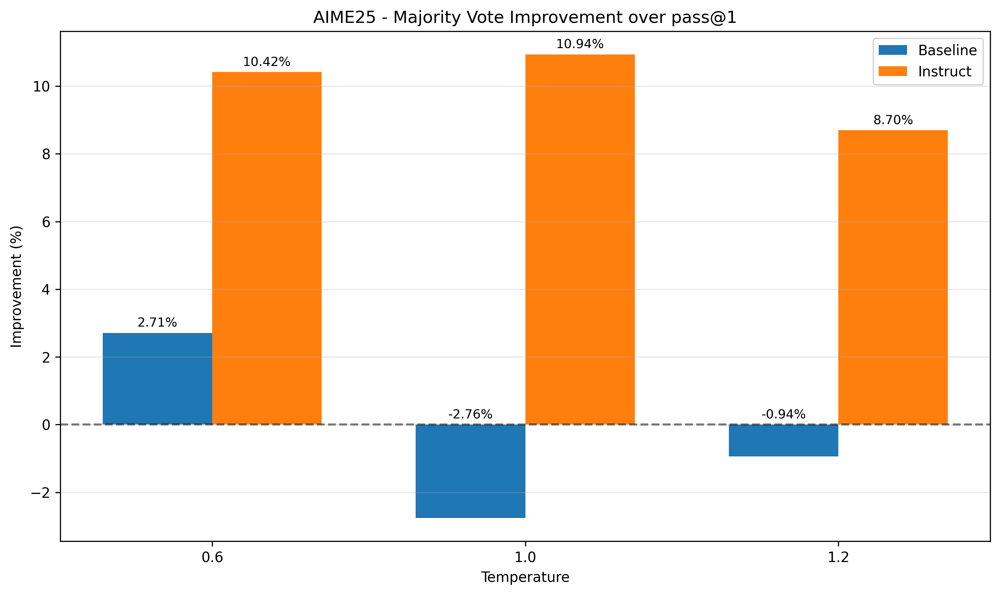

# Qwen Test-Time Scaling on Math Datasets 结果数据分析可视化

## 项目概述

本项目提供对三个数学竞赛数据集（AMC23、AIME25、MATH500）的全面分析，包括温度参数对模型性能的影响、基线模型与指令模型的对比、以及多数投票策略的效果评估。

## 文件命名方法

### 评估结果文件

- 遵循 `*_eval.jsonl` 命名格式，包含温度参数信息
- 示例：`amc_baseline_temp06_eval.jsonl`（AMC基线模型，温度0.6）
- 示例：`aime_instruct_temp10_eval.jsonl`（AIME指令模型，温度1.0）

### 可视化文件

- 以数据集名称开头，后面接可视化类型描述
- 示例：`amc_temperature_effects.png`（AMC温度影响图）
- 示例：`aime_model_comparison.png`（AIME模型对比图）

### 结果汇总文件

- 各数据集独立汇总：`{dataset}_results_summary.csv`
- 全局对比文件：`model_comparison.csv`、`temperature_effects.csv`

## 项目结构

```text
├── analyze_amc_example.py    # AMC数据集专项分析脚本
├── analyze_results.py        # 多数据集综合分析脚本
├── README.md                 # 项目说明文档
├── requirements.txt          # 项目依赖
├── res                       # 结果数据目录
│   └── cleaned               # 清洗重命名后的评估数据
│       ├── aime_baseline     # AIME25基线模型评估数据
│       ├── aime_instruct     # AIME25指令模型评估数据
│       ├── amc_baseline      # AMC23基线模型评估数据
│       ├── amc_instruct      # AMC23指令模型评估数据
│       ├── math500_baseline  # MATH500基线模型评估数据
│       └── math500_instruct  # MATH500指令模型评估数据
└── visualizations            # 可视化结果目录
    ├── {dataset}_*.png       # 各数据集可视化图表
    ├── {dataset}_*.pdf       # 各数据集PDF格式图表
    ├── {dataset}_results_summary.csv  # 各数据集结果汇总
    └── global_*.csv          # 全局对比分析文件
```

### 核心文件说明

- **analyze_amc_example.py**：AMC数据集专项分析脚本，包含数据加载、指标计算、结果分析和可视化功能
- **analyze_results.py**：多数据集综合分析脚本，支持AMC、AIME和Math500数据集的批量分析和对比
- **README.md**：项目说明文档，包含文件结构、运行方法和性能指标说明
- **requirements.txt**：列出项目所需的Python依赖库（pandas、numpy、matplotlib等）

## 运行方法

```bash
# 安装依赖
pip install -r requirements.txt

# AMC数据集分析
python analyze_amc_example.py

# 运行综合分析（所有数据集）
python analyze_results.py
```

### 4. 查看结果

- **控制台输出**：性能指标表格和统计分析结果
- **可视化结果**：保存到 `visualizations/` 目录，包括PNG和PDF格式
- **数据汇总**：各数据集独立汇总文件（如 `amc_results_summary.csv`）
- **全局对比**：跨数据集对比文件（如 `model_comparison.csv`）

## 分析内容

### 温度影响分析

- 温度参数范围：0.6、0.8、1.0、1.2
- 分析不同温度对模型性能的影响
- 生成温度-性能关系曲线

### 模型对比分析

- 各温度下的模型表现差异

| Math500                                           | AMC23                                         | AIME25                                         |
| ------------------------------------------------- | --------------------------------------------- | ---------------------------------------------- |
|  |  |  |

- 多数投票策略效果评估

| Math500                                                     | AMC23                                                   | AIME25                                                   |
| ----------------------------------------------------------- | ------------------------------------------------------- | -------------------------------------------------------- |
|  |  |  |

### 多数投票改进分析

- 计算多数投票相比pass@1的改进幅度
- 分析不同数据集和模型的投票效果

## 性能指标说明

- **pass@k**：表示在k次尝试中至少有一次正确的概率
- **maj@1**：表示多数投票的正确率
- **改进幅度**：maj@1相比pass@1的性能提升百分比

## 注意事项

- 脚本默认从 `res/cleaned/` 目录加载数据
- 如需修改数据路径，请在相应脚本的 `main()` 函数中调整 `base_dir` 参数
- 可视化结果将自动保存到 `visualizations/` 目录，如该目录不存在将自动创建
- 支持的温度参数范围：0.6、0.8、1.0、1.2
